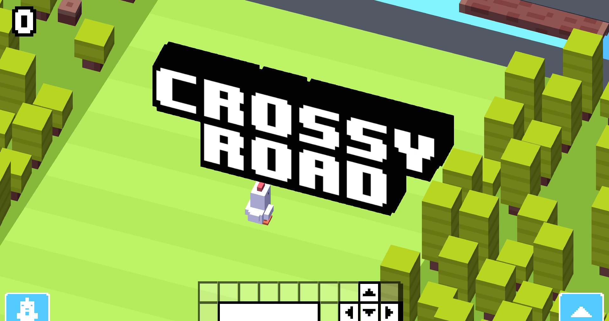
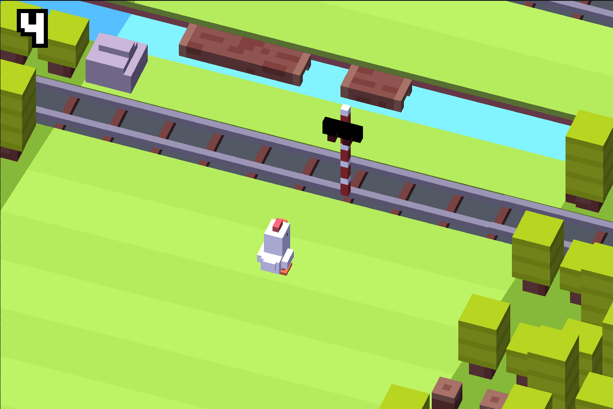
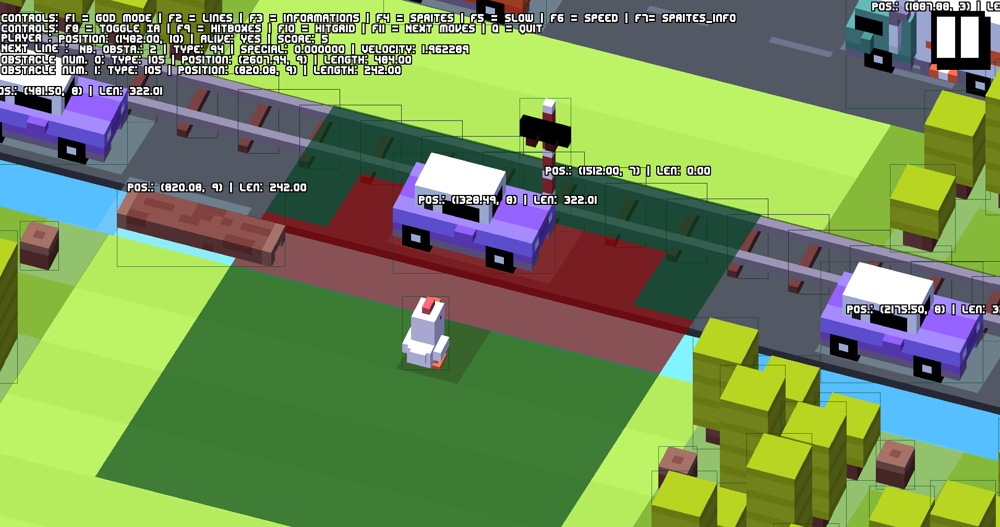
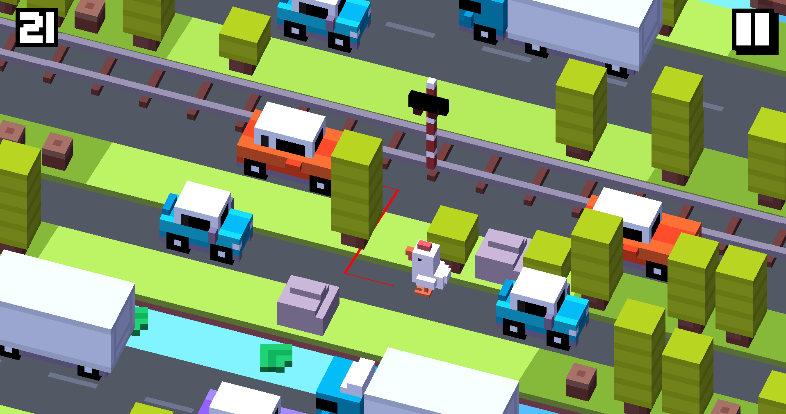

# Crossy Road - IA 

Ce projet est une réimplémentation du célèbre jeu **Crossy Road**, disponible en deux versions :
- Une version jouable en terminal (TUI) à l'aide de la bibliothèque `ncurses`
- Une version avec interface graphique (GUI)



## Objectifs

- Reproduire les mécaniques de **Crossy Road** dans un environnement en ligne de commande et graphique
- Utiliser `ncurses` pour gérer l'affichage et les interactions dans le terminal
- Implémenter une interface graphique moderne avec SDL2
- Développer une architecture modulaire permettant d'étendre facilement le jeu
- Créer une IA pour jouer automatiquement

## Fonctionnalités

- Affichage en temps réel dans le terminal ou en interface graphique
- Déplacement du joueur (avant, arrière, gauche, droite)
- Gestion des routes et des obstacles
- Rafraîchissement dynamique de l'écran
- Contrôles clavier (flèches directionnelles)

### Mécaniques de jeu
- Différents types de terrain (herbe, route, eau)
- Variété d'obstacles (arbres, rochers, voitures, camions, trains)
- Système de score progressif
- Difficulté croissante avec le score
- Détection des collisions
- Animation des déplacements

### Version GUI spécifique
- Rendu graphique 3D isométrique


- Sprites pour tous les éléments du jeu
- Animations fluides
- Affichage du score et des statistiques
- Mode debug pour visualiser les hitbox et les données techniques




En mode débug il est possible : 
- de passer en GodMod (F1)
- d'afficher la grille de déplacement (F2)
- d'afficher des informations de debug (F3)
- afficher les hitbox (F4)
- ralentir le temps (F5)
- accelerer le temps (F6)
- afficher les positions des obstacles (F7)
- activer l'IA (F8)
- afficher hitbox au sol (F9)
- afficher le chemin à suivre de l'IA (F10) 

# Comment jouer

- Utilisez les flèches directionnelles pour vous déplacer
- Évitez les obstacles et les véhicules
- Traversez les rivières en sautant sur les rondins ou nénuphars
- Progressez aussi loin que possible pour augmenter votre score
- Le jeu s'accélère avec l'augmentation du score

## Installation

### Prérequis

Assurez-vous d’avoir les paquets suivants installés :

```bash
sudo apt update
sudo apt install libncurses-dev build-essential
# Pour la version GUI
sudo apt install libsdl2-dev libsdl2-image-dev libsdl2-ttf-dev
```

### Compilation

Clonez le projet et compilez avec make :
```bash
git clone https://gibson.telecomnancy.univ-lorraine.fr/projets/2425/ppii-s6/ppii-s6-grp-26.git
cd ppii-s6-grp-26
make
```

### Tests

Exécuter les tests : 
```bash
make run_tests
```

### Nettoyer le projet

Nettoyer les fichiers de compilation : 
```bash
make clean
```

## Exécution

### Lancer la version TUI

```bash
git checkout TUI # aller sur le commit spécifique au TUI
make clean
make run_tui
```

### Lancer la version GUI

```bash
git checkout main
make clean
make run_gui
```

## Difficultés progressives

Le jeu s'adapte au score du joueur avec plusieurs niveaux de difficulté:
- **Facile** (début)
- **Normal** (score > 10)
- **Moyen** (score > 25)
- **Difficile** (score > 50)
- **Expert** (score > 100)

À chaque niveau, les paramètres suivants sont modifiés:
- Nombre et vitesse des véhicules
- Fréquence des trains
- Complexité des traversées d'eau
- Densité des obstacles

## Structure du projet

```bash
.
├── assets
│   ├── Crossy_road.png
│   ├── DroidKufi-Regular.ttf
│   ├── editundo.ttf
│   ├── Hardpixel.otf
│   ├── high_scores.json
│   ├── spritesheet_coord.json
│   ├── spritesheet.png
│   ├── ui_spritesheet_coord.json
│   └── ui_spritesheet.png
├── Cahier des charges.xlsx
├── CR
│   ├── 21_05.pdf
│   ├── 27_05.pdf
│   ├── CR 06_05.pdf
│   ├── CR 12_03.pdf
│   ├── CR 13_05.pdf
│   ├── CR 19_03.pdf
│   ├── CR 23_04.pdf
│   ├── CR 26_03.pdf
│   ├── CR 29_04.pdf
│   ├── CR 4_04.pdf
│   ├── CR 5_03.pdf
│   └── Notes
│       ├── 21_05.docx
│       ├── 27_05.docx
│       ├── CR 06_05.docx
│       ├── CR 12_03.docx
│       ├── CR 13_05.docx
│       ├── CR 19_03.docx
│       ├── CR 23_04.docx
│       ├── CR 26_03.docx
│       ├── CR 29_04.docx
│       ├── CR 4_04.docx
│       └── CR 5_03.docx
├── Etat de l’art crossy road.docx
├── include
│   ├── board.h
│   ├── debugKit.h
│   ├── game.h
│   ├── ground.h
│   ├── gui.h
│   ├── ia.h
│   ├── macro.h
│   ├── obstacle.h
│   ├── player.h
│   ├── random_custom.h
│   ├── ttf.h
│   └── UI.h
├── main_gui.c
├── Makefile
├── README.md
├── src
│   ├── board.c
│   ├── game.c
│   ├── ground.c
│   ├── gui.c
│   ├── ia.c
│   ├── obstacle.c
│   ├── player.c
│   ├── random_custom.c
│   ├── ttf.c
│   └── UI.c
└── Tests
    ├── test_board.c
    ├── test_ground.c
    ├── test_gui.c
    ├── test_ia.c
    ├── test_obstacle.c
    ├── test_player.c
    ├── test_random_custom.c
    ├── test_ttf.c
    └── test_UI.c

```


## Contributeurs

Ce projet a été développé dans le cadre du PP2I à Télécom Nancy.
